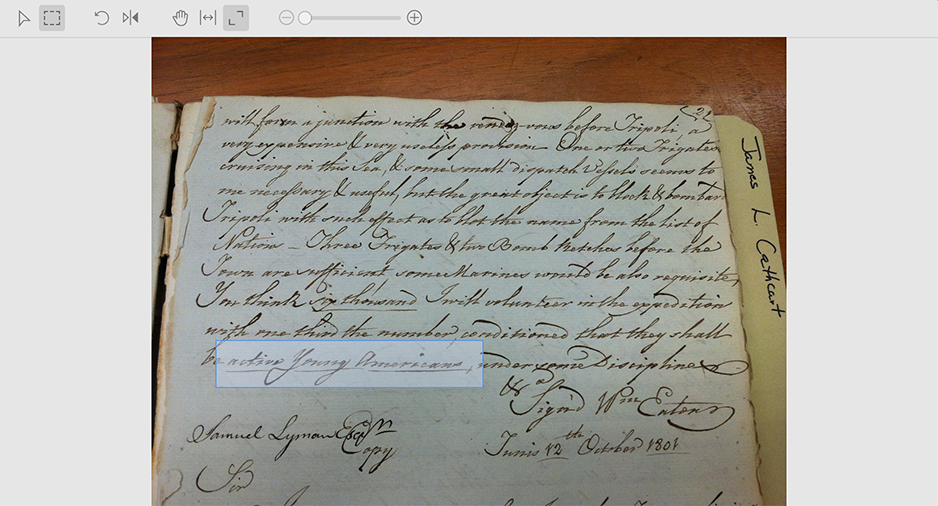

# Create selections within an item.

Selections are a tool for capturing specific portions of an item that you wish to highlight or analyze further. They essentially create a cropped copy of your photo that you can then rename and add notes to.

## Create a selection.

To create a selection, click on the [_Select_ button](photo-editing.md) on the photo editing toolbar. Then draw a rectangle on your photo that includes the area you wish to select.

When you have created a selection, it appears nested underneath its origin photo in the Photos pane on the lefthand side of the item view. If you click on its name there, the selection will appear highlighted in the item view.

## Add metadata to your selection.

To change the name of your selection, click on its name in the Photos pane to select it. Then click the name again to enter editable mode. You can then change the name of the selection. 

To enter more customized metadata about your selection, you can scroll down in the metadata pane to see and edit the selection metadata. Selection metadata templates are [fully customizable](../in-the-template-editor/create-template.md), just like item-level and photo-level templates, so you can add a great deal of metadata specific to your selection.

When you have a selection highlighted, whatever notes you type in the notes field attach to that selection.

## Save a selection as its own image.

You can export a selection to its own file, including all changes you've made using the photo editing tools. To do so, right-click on the selection in the Photos pane, and click _Export Selection_. Tropy will prompt you to save your selection. It will fill in a .png file extension; if you wish, you may change that extension to .jpg. Select where you want to save your selection, and click _Save_.

