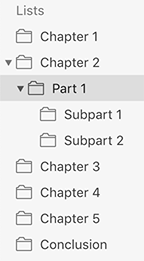

# Organize items into lists.

Lists are a tool for organization. You can use lists to select items that are linked thematically or topically. Items can appear in multiple lists, so you can use lists for both structured organization \(such as chapters or sections of your research\) or more unstructured thematic organization \(such as Imperialism or Politics\). Items in lists also remain in the main project view.

## Create a new list.

1. Create a new list by going to _File_ &gt; _New_ &gt; _List_. The new list appears in the sidebar. Now type a name for your list and press Enter.
2. Create a list by right-clicking on _Lists_ or your project name in the left pane and selecting _New List_.

#### Nested lists

You can nest lists within each other, creating a list hierarchy. To create a new nested list, right-click on the name of the parent list and select _New List._ You can then name your new list whatever you want. 

To nest an existing list within another list, drag and drop the list name onto the name of the list you want it nested inside. 

## Add items to a list.

Drag and drop an item onto the list name in order to add it to that list. \(The item will remain in the main project view.\) Items can appear in more than one list.

You can add multiple items to a list at once, by selecting multiple items \(using Ctrl/Command+click or Shift+click\) and then dragging them to a list name.

## Remove items or lists.

To remove an item from a list: Right-click on the item in the list and select _Remove Item From List._

To delete a list: Right-click on the list name and select _Delete list._

