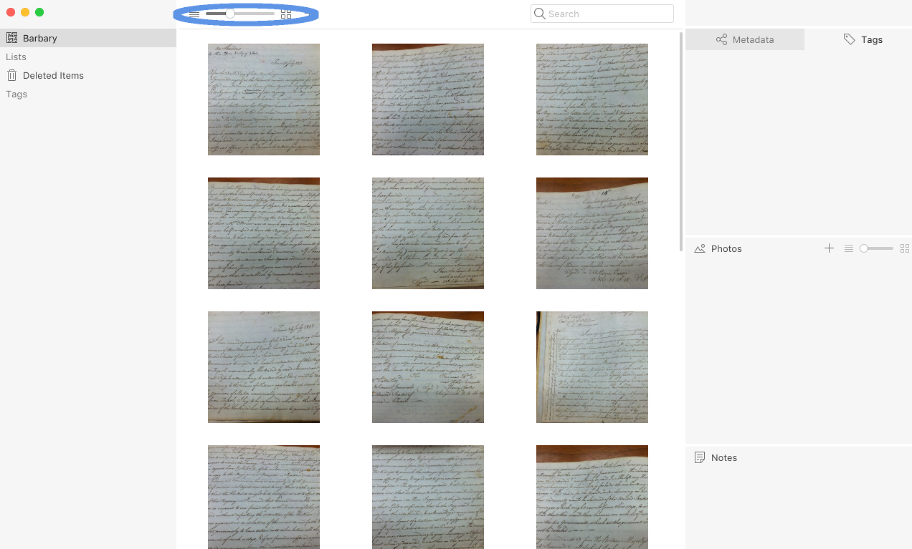

# View photos in project view.

Tropy has two views for working with your items. The project view appears by default when you open Tropy. It lists all of your items, allowing you to see your work in broad terms and edit or tag in bulk. The item view allows you to focus on one particular item, giving you a place to add notes or transcription. Both views allow you to edit metadata and tags.

## Project view

In project view, you can view your items in a list or in a photo grid. To switch between these views, use the slider at the top of the item table. Your photos appear as a list when the slider is all the way to the left. The default columns in the list view correspond to commonly used fields in the [Tropy Generic](../before-you-begin/metadata.md) template.

You can see a full-size preview of any of your items by pressing Space. Press Space again to clear the preview.

### Photo enhancement in project view

To change the orientation of your items' photos, right-click on the item you wish to rotate, then click Rotate Left or Rotate Right. You can also use the keyboard by pressing Ctrl/Cmd + \[ or Ctrl/Cmd + \]. Changing orientation in the item table in project view changes all the photos in an item, or all the photos in all the items you have selected. 

To rotate individual photos within an item, select a photo from the photos pane to the right of the item table instead of an item in the item table. 

### List view features

If you are viewing your photos as a list, you can make changes to the default setup.

**Sort the list by column.** Click on the name of the column you want to sort by. The arrow \(^\) indicates which column your items are sorted by and whether they are sorted ascending \(^\) or descending \(ˇ\).

**Re-order the columns.** Click on the column header and drag it to the location you want it.

**Select different columns to view.** To change or add columns, right-click on any column header. Select the columns you want to appear in the list view. You can select by scrolling through the list of fields, or you can type the name of your desired field into the search bar that appears at the top of the context menu. Once you've identified your field, click on it to select it.

Once you've selected the columns you want, you can re-order them by clicking and dragging into place.

_Which fields can be column headers?_

Any field that appears in your vocabularies can be a column header, plus a few additional fields. Right-clicking on the column header will show all fields that appear in currently installed templates in your Tropy. If you press Shift or Alt with the right-click, you will be able to see all fields that exist in any vocabulary you have installed.

Tropy also propagates a few fields automatically with every item: "Date added" and "Date modified." These fields can be columns in the list view as well.

### Grid view features

Moving the slider to the right switches the display to a grid. **Note**: The images in this view are simply thumbnails. Your photos have not been cropped to be square; in the item view they will show up full-sized.

## Item view

To move to item view, double-click on one of your items.

