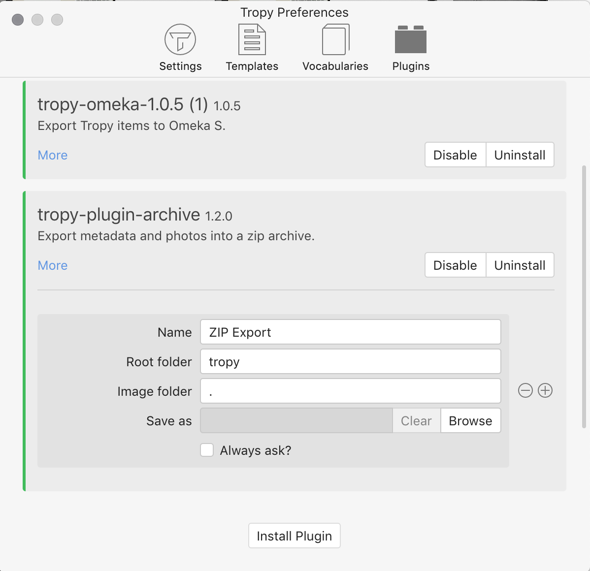
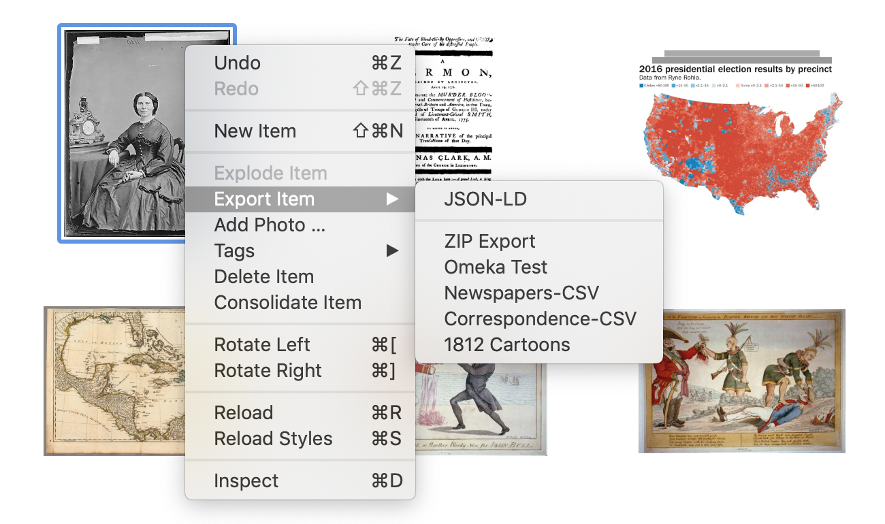

# Export with Archive plugin

The Archive plugin allows you to export items in full--including photos, metadata, and notes--to a ZIP archive. This ZIP archive can then be transferred to another computer or device.

### Getting the Archive plugin

First, download the latest release [here](https://github.com/tropy/tropy-plugin-archive/releases). 

Then navigate to Preferences &gt; Plugins. Click on "Install plugin" and navigate to wherever the ZIP folder saved on your computer. Select the ZIP folder \(don't unzip it\) and click "Open."

The plugin should now appear in your list of plugins. Click "Enable" to activate the plugin.

You'll then see a number of options. You can give your plugin a name, if you like \(or you can leave it blank\). The "Root folder" option tells Tropy where to save your archive when you've generated it. You can set a place on your computer that your archive will automatically save to. You can also change where the images are saved, if you want them separate from the metadata \(though we do not recommend this for general use\). 

The "Save as" allows you to customize the location of the save as well as the name of the ZIP folder.

If you select "Always ask?" you will get a dialog box every time you use the plugin in the main Tropy interface that asks you where you'd like to save the folder and what you'd like to call it.

Once you've set up your preferences, close the Preferences window \(no save necessary\).

### Using the Archive plugin

To export using the archive plugin, select the item or items you want to archive. Right-click on the item\(s\) and navigate to Export. Then select the name that you gave the plugin. 

If you selected "Always ask?" a dialog box will open and you can select the place you wish to save and the name you wish your folder to have. If you did not, then your ZIP archive will save to the location you set in Preferences. 

