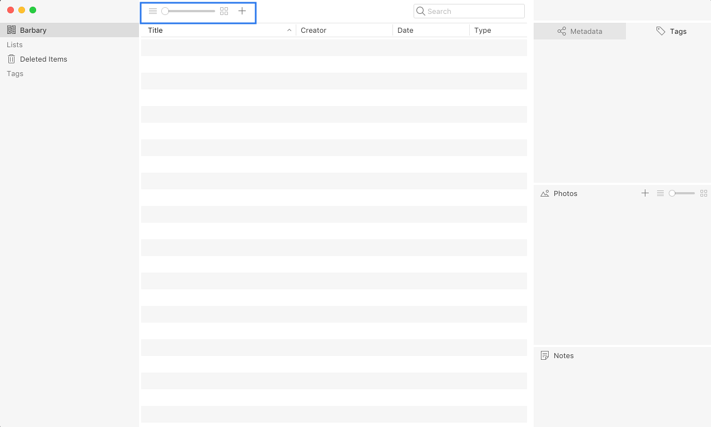

# Add photos to Tropy.

When you import a photo, Tropy makes a thumbnail copy of the photo. The original photo remains in its original location on your hard drive. You have several options for adding photos to your project.

* Navigate to _File_ &gt; _Import photos_. You can select one photo from your files, or using Shift+click or Ctrl/Command+click, you can select multiple photos. To select all photos in a folder, type Ctrl/Command+A. Then click _Open_ in the dialog box.
* Click the + in the menu bar above the item table in project view.

  

* From your computer’s file system, navigate to the folder where your photos are, and select one or more photos. Then drag those photos into the middle pane of Tropy in order to add them.

Depending on the number of photos you are importing, you should expect import to take some time.

**Note:** At this time, Tropy does not support drag-and-drop directly from Apple’s photo software, including iPhoto and Photos.app. To get photos from Photos, export your photos to a different location on your computer and then follow the steps above. **We strongly, strongly recommend that you do not store your research photos in Apple Photos long-term, whether you use Tropy or not.**

You may want to add an item that does not yet have any photos attached to it. To do so, go to _File_ &gt; _New_ &gt; _Item_. You can then add photos to that item just as you would add photos to an item that already contains photos.

**Troubleshooting**: When you import photos into Tropy, make sure the search box is clear; otherwise it will seem like your photos are not importing.

### Importing large files from PDF/SVG

If you are working with very large files, you may need to make some adjustments in order for Tropy to render them. 

To render your files at a different density, change the pixels per inch setting in the metadata panel. You can access the ppi setting in the Photo pane. The default is 72ppi. If your image is not high enough quality at 72ppi, you can increase it \(you should try 144ppi and then 300ppi\). Once you have changed the PPI, the image viewer should refresh your image.

You can change the default ppi setting at which images are imported in _Preferences_ &gt; _Default density._

### Dragging images directly from a web browser

Tropy allows you to drag static images into Tropy directly from a web browser. Click and hold on the image you wish to import and drag it onto the item table. This action creates a link to the web version of the image; it does not download it. To access the original web location of the image, right-click on the photo name in the photos panel and select _Show original photo._

**Note:** This method does not work with images that are displayed within an interactive image browser \(such as the New York Public Library's interface\). To use images displayed in an interactive browser, you'll need to use the download options and save a local copy of the image.

### Importing JSON-LD files

You can import JSON-LD files into Tropy. JSON-LD files allow both images and metadata to be imported into Tropy. To import JSON-LD files, follow the same procedure as importing an image, but be sure to import the JSON-LD file itself, not the associated images. The JSON-LD file will find the correct images to import along with the metadata.

## Consolidate your photo library.

If you make changes to the originals of your photos, you will need to tell Tropy that you've made changes. \(For instance, perhaps you cropped or changed the contrast on a photo outside Tropy.\) This process is called consolidation.

To consolidate, navigate to _File_ &gt; _Consolidate Photo Library_. You don't need to do anything else; this command lets Tropy recreate any thumbnails that are missing or have been changed.

You can consolidate individual photos by right-clicking on them in the Photos pane and selecting _Consolidate photo._

## 

