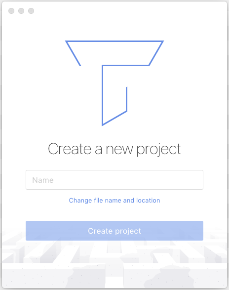

# Create a new project.

A project is a collection of photographs. Because Tropy allows for a lot of flexibility in each project, it usually makes sense to conceive of a project in broad terms: a project as a book or thesis, not a chapter. You can use lists, tags, and/or notes to organize material within a Tropy project.

**From the menu bar**: Click on _File_ &gt; _New_ &gt; _Project_.

**To change where your project is saved**:  
By default, your project saves to your documents folder on your hard drive \(My Documents in Windows, Documents in macOS, etc.\).

To change where your project is saved, click on _Change file name and location_ in the “Create new project” dialog box. Then select a new location. You can also rename the file so that the name of the project is different from the name of the file. Then click _Save_ to return to the "Create new project" dialog box. When you have named your project, click _Create project_.

**To find out where your project is saved**:  
Once you are in Tropy, if you need to find out where your project is saved, right-click on its name in the sidebar and select _Show project file._

### Open multiple projects at the same time_._

To open multiple projects at the same time, navigate to _File &gt; Open in New Window_ and select the project you wish to open in addition to the project you currently have open. You can [copy and paste items](../in-the-project-view/copy-and-paste-items..md) between projects \(though there is diminishing utility in this the more you do it; if you find you're copying large quantities of items, you should consider combining your two projects into one\).

